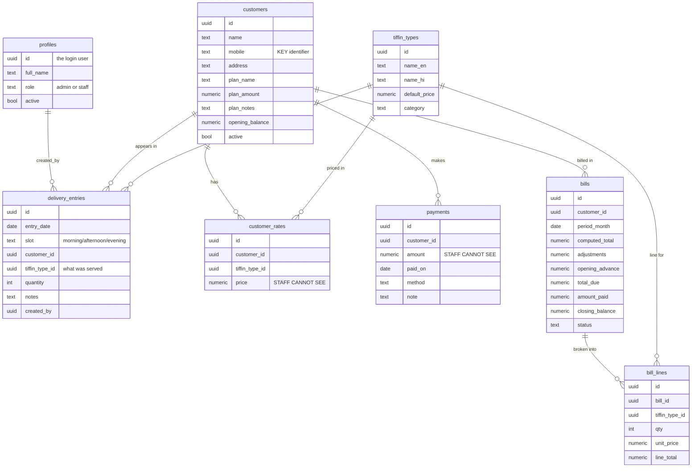

# Aditya Tiffin Service — Management System Plan

*Prepared July 5, 2026. This is a design/plan document to review before any code is written.*

---

## 1. The big picture

We keep **one project**. Your existing marketing site stays public; the management app is added behind a login. Nothing about the public page changes for customers.

```
tiffinservice.com/            → Public landing page (what you have today)
tiffinservice.com/manage      → Login screen
tiffinservice.com/manage/...  → Private app (only after login)
```

**Frontend:** your existing React + Vite + Tailwind app, extended with page routing (`react-router`) and reusing your Hindi/English toggle. Management screens are **mobile-first** — your mother and the delivery person will use phones.

**Backend:** **Supabase** (free tier) provides three things we can't build in the browser alone:

1. **Logins** — each person signs in with their **mobile number + a PIN** (no SMS, no cost — see §10).
2. **Database** — customers, daily lists, payments, bills.
3. **Row Level Security (RLS)** — rules enforced *inside the database*, so a staff login is physically unable to read payments or edit an old date, even if someone inspects the app.

**Cost: ₹0.** Free hosting (Vercel/Netlify/Cloudflare Pages) + Supabase free tier. The only paid extra, entirely optional, is a custom domain later (~₹800/year); until then a free `*.vercel.app` address works.

> **Why not a spreadsheet or a plain webpage?** A plain webpage cannot hide payment data from staff — anyone can open the browser tools and read whatever the page downloaded. Google Sheets has the same problem and can't lock past dates. The privacy rules you need *must* be enforced by a real backend. That's the whole reason for Supabase.

---

## 2. Who can do what (roles)

Three tiers. **Owner** = you (Aditya, `8800811493`) — same powers as admin, plus the *only* person who can permanently erase anything. **Admin** = your mother — full day-to-day and money access, but every removal she makes is reversible (see §7). **Staff** = delivery person(s).

| Capability | Owner | Admin | Staff |
|---|:---:|:---:|:---:|
| Log in | ✅ | ✅ | ✅ |
| See **today's** lists (all 3 slots) | ✅ | ✅ | ✅ |
| Add / remove a customer in **today's** list | ✅ | ✅ | ✅ |
| Record what was served (veg / chicken / etc.) in today's list | ✅ | ✅ | ✅ |
| Copy a list from a past date into **today** | ✅ | ✅ | ✅ |
| Edit / fix a **past or future** date's list | ✅ | ✅ | ❌ |
| Add a new customer's contact info (name, mobile, address) | ✅ | ✅ | ✅ |
| See or set customer **rates & plans** | ✅ | ✅ | ❌ |
| Record & view **payments** | ✅ | ✅ | ❌ |
| Generate & view **bills** | ✅ | ✅ | ❌ |
| Add / remove **staff**, reset PINs | ✅ | ✅ | ❌ |
| Add / remove an **admin** | ✅ | ❌ | ❌ |
| Restore a deleted item (from Trash) | ✅ | ✅ | ❌ |
| **Permanently erase** data / empty Trash | ✅ | ❌ | ❌ |

The two hard rules from your requirement — *staff never see money* and *staff can't touch old dates* — are the ✅/❌ marks in bold rows above, and they are enforced by the database, not just hidden in the screen. The bottom two rows are the safety net for your mother: she can undo her own mistakes, but **nothing she does can permanently destroy data** — only you (Owner) can, and even then with warnings (see §7).

---

## 3. What we store (data model)

Nine tables. Money-related tables (rates, payments, bills) are separated so the database can block staff from them cleanly.



**In plain words:**

- **profiles** — the people who log in, each tagged `admin` or `staff`.
- **customers** — the master list. `mobile` is the key identifier (as you said); `name` and `address` are also stored. Each customer carries their `plan_name`, `plan_amount`, free-text `plan_notes` (e.g. *"₹3300 plan, 1 chicken + 1 egg per week included, mutton always extra"*), and an `opening_balance` (advance or dues carried in).
- **tiffin_types** — the menu catalog: Veg (₹70), Chicken (₹130), Fish (₹130), Egg (₹90), Mutton (₹180), plus specials (Special Veg Thali, Special Chicken Thali) and roti packs (10 rotis, 30 rotis). These are the *default* prices.
- **customer_rates** — per-customer price overrides, because *"prices can vary customer to customer."* If a customer has no override for an item, the default price is used. **Staff cannot read this table.**
- **delivery_entries** — the heart of daily operations. One row = one customer, one slot (morning / afternoon / evening), one date, and *what was served* to them. No rate here — exactly as you wanted; the rate is looked up at billing time.
- **payments** — money received, any day of the month, with method (cash/UPI) and a note. **Staff cannot read this table.**
- **bills** — one per customer per month: the computed total, mother's manual adjustment, opening advance/dues, amount paid, and closing balance carried to next month. **Staff cannot read this table.**
- **bill_lines** — the itemized breakdown that appears on the bill you send.

---

## 4. How the daily list works (most-used screen)

This is what your mother and delivery person open every day. Designed to be fast on a phone.

1. Open the app → pick a **slot** (Morning / Afternoon / Evening) for **today**.
2. See the list of customers already added, with what's being served to each.
3. **Add** a customer (search by name/mobile, tap to add). **Remove** with one tap.
4. Set the served item per customer (Veg / Chicken / Mutton…). Default can be pre-filled.

**Copy from another day** — exactly your request:

> *"If I want the list for today afternoon, I copy directly from yesterday afternoon; otherwise I give a date and copy the list from then."*

A **Copy** button offers: *"Copy from yesterday, same slot"* (one tap) or *"Choose a date"* → pick date + slot → it fills today's list with those customers (and pre-fills what they usually take, editable). You then tweak add/remove for today.

**The past-date rule:** staff see today by default and can only edit today. If a staff member opens an old date, it's read-only. You and your mother can open and fix any date. This is enforced in the database: staff writes are only allowed when `entry_date = today` (India time).

---

## 5. How monthly billing works

At month end your mother currently tallies by hand. The system turns that into: **it proposes the numbers, she reviews and adjusts, then sends.**

For a chosen customer and month, the system:

1. Scans all their `delivery_entries` for the month → counts days, and groups by what was served (e.g. *"42 veg, 4 chicken, 1 mutton, 8 evening rotis"*).
2. Applies each item's **rate for that customer** (override, else default) → a **computed total**.
3. Handles the **plan**: if the customer is on a flat plan (e.g. ₹3300) that includes certain weekly non-veg, those included servings aren't charged again; extras (mutton, specials) are added on top. *(This is the piece with the most variation between customers — see open questions in §9. For v1 the plan is stored as amount + notes, the system shows a suggested figure, and your mother can adjust before finalizing.)*
4. Adds the **opening advance/dues** carried from last month, subtracts **payments** received during the month → **closing balance** (which becomes next month's opening).
5. Produces a clean bill you can **send on WhatsApp** (reusing your site's WhatsApp link) or download as PDF.

Nothing is charged automatically — your mother always sees the breakdown and can adjust before it's final.

---

## 6. Security, in one paragraph

Supabase gives each screen a "public key" that is safe to ship in the app. On its own that key can't read anything sensitive — every table has Row Level Security policies that check *who you are* before returning a single row. Staff policies simply don't grant access to `customer_rates`, `payments`, or `bills`, and only allow daily-list writes for today. So even a curious staff member with developer tools sees nothing about money. The secret admin key is never put in the app.

---

## 7. Guardrails against accidental data loss (protecting your mother's account)

Since your mother is an admin but not comfortable with computers, the app is built so that **no everyday action can permanently destroy anything.** Six layers, working together:

1. **Nothing is ever truly deleted by a normal action.** "Delete" always means *hide/archive* — the record is flagged as removed but stays in the database. A removed customer, a cleared day's list, even a deleted payment can be brought back. Only the Owner (you) can *permanently* erase, from a separate, clearly-marked screen.

2. **Trash / Recycle bin.** Everything removed goes to a **Trash** you or your mother can open and **Restore** with one tap. Items stay there indefinitely (we can auto-clean after, say, 90 days if you want) — so a mistake is never urgent.

3. **Clear confirmations, in Hindi.** Any removal shows a plain-language "Are you sure?" with the specific thing named — e.g. *"राम कुमार को आज की सूची से हटाएं?"* ("Remove Ram Kumar from today's list?"). Big, well-separated **Yes / No** buttons so a mis-tap doesn't confirm.

4. **Undo.** Right after a removal, a *"Removed — Undo"* bar appears for a few seconds. One tap puts it back, no need to even open the Trash.

5. **No bulk-delete or "delete all" buttons anywhere in the everyday screens.** Removals are one item at a time. There is simply no button that could wipe a whole month or all customers at once — that capability doesn't exist in the UI your mother uses.

6. **Automatic daily backup.** Once a day the whole database is exported to a file (kept in your connected folder / downloadable). Supabase's free tier keeps no backups of its own, so this is our safety copy — even in a worst case, yesterday's data is always recoverable.

**In short:** your mother can freely add and remove things without fear. The worst she can do is move something to Trash, which you or she can restore in seconds. Permanent erasure is Owner-only and deliberately out of the way.

---

## 8. Build plan (phases)

Each phase is usable on its own, so you get value early and can course-correct.

**Phase 0 — Foundation (setup)**
Create the free Supabase project; create the database tables and security rules; seed the tiffin types with your prices; add the login screen and page routing to the app; create your, your mother's, and the delivery person's logins.

**Phase 1 — Customers**
Screen to add/edit customers (name, mobile, address), set per-customer rates, and record plan + opening balance. Admin only.

**Phase 2 — Daily lists** *(the core, most-used feature)*
The 3-slot daily screen: add/remove customers, record served item, copy-from-date, today-only lock for staff. Mobile-first, Hindi/English.

**Phase 3 — Payments**
Record payments any day; per-customer ledger showing running balance. Admin only.

**Phase 4 — Monthly billing**
Month-end summary per customer, computed totals with rates + plan handling, advance carry-over, manual adjustment, finalize, and send bill via WhatsApp / PDF.

**Phase 5 — Polish**
Simple dashboard (today at a glance, who's unpaid), month reports, and a one-click data export for your own backup.

---

## 9. Decisions still open (we can settle these as we build)

1. **Staff & new customers** — proposed: staff *can* add a new customer's name/mobile/address (so they're never blocked at the door), but *cannot* set rates or see money. You fill rates later. OK?
2. **Plan billing model** — some customers are pure "pay per tiffin," others are flat-plan (₹3300) + extras. v1 stores plan amount + notes and lets your mother adjust the computed figure. Later we can encode specific plan rules (e.g. auto-free "1 chicken/week") if you want it fully automatic.
3. **Multiple staff logins** — one shared staff login, or one per delivery person? Separate logins let you see who added what.
4. **Custom domain** — free `*.vercel.app` address now, or buy a domain later.

---

## 10. What I'll need from you (only at Phase 0)

- Create a **free Supabase account** (I'll walk you through it — 5 minutes).
- Give me the **mobile numbers** for you, your mother, and the delivery person — that's how they'll sign in. I can generate starting PINs, or you can set them.
- Confirm the **tiffin types and default prices** (I've listed them from your message in §3).

Everything else I build and wire up. No payment or credit card required at any point.

**A note on login by mobile number.** True OTP-by-SMS is *not* free: Supabase doesn't send SMS itself — it forwards to a provider like Twilio or MSG91, each of which charges per message, and India's TRAI/DLT rules add registration paperwork ([Supabase phone login docs](https://supabase.com/docs/guides/auth/phone-login)). For just 3 people signing in daily, waiting for an OTP each time is also slow and depends on the SMS actually arriving. So we use the **mobile number as the login name plus a short PIN** — completely free, instant, and reliable. You (admin) create each account once, set the PIN, and can reset a forgotten PIN anytime. If you ever want real SMS OTP later, we can plug in a low-cost Indian provider (~₹0.25/SMS) without rebuilding anything.
